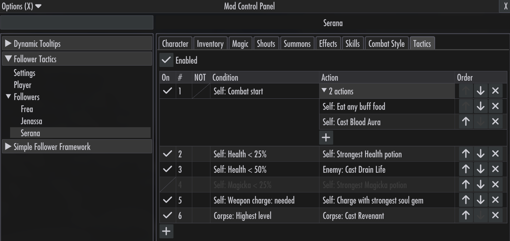

# Follower Tactics

**Follower Tactics** is a Skyrim mod for player and follower tactics, follower equipment management, and follower training. It is inspired by [Dragon Age: Origins](https://dragonage.fandom.com/wiki/Tactics_(Origins)) and [Pillars of Eternity II](https://www.gamepressure.com/pillars-of-eternity-2/partys-ai/z1ae65).

## Features

- Set condition-action [tactics](https://whocares66-dev.github.io/SkyrimFollowerTactics/tactics/) for the player and followers, with separate combat and idle rules.
- Inspect player and follower inventory, magic, skills, active effects, and more.
- Manage follower equipment with [pins and bans](https://whocares66-dev.github.io/SkyrimFollowerTactics/equip-states/).
- [Train followers](https://whocares66-dev.github.io/SkyrimFollowerTactics/training/) through skill use, reassign attributes and perks, and teach or forget spells without permanently changing their original abilities.
- Install as an SKSE plugin, with no ESP.

The mod focuses on understanding followers, setting their tactics, and training them. It preserves the underlying combat AI and works alongside follower management frameworks. Disabling training or removing the mod restores followers' normal state. It does not automatically rebalance characters.

## Getting started

One DLL runs on **Special Edition 1.5.97** and every **Anniversary Edition** build, 1.6.317 through the current 1.7.104. VR is not supported. Development and in-game verification use 1.5.97, 1.6.1170 and 1.7.104.

Install these dependencies for your runtime:

- [SKSE64](https://www.nexusmods.com/skyrimspecialedition/mods/30379)
- [Address Library for SKSE Plugins](https://www.nexusmods.com/skyrimspecialedition/mods/32444)
- [SKSE Menu Framework](https://www.nexusmods.com/skyrimspecialedition/mods/120352)

Install Follower Tactics through your preferred mod manager, such as [Mod Organizer 2](https://www.nexusmods.com/skyrimspecialedition/mods/6194). In game, open the SKSE Menu (default **F1**) and select **Follower Tactics**.

### Compatibility

Supports vanilla followers, including Serana, and follower management systems such as [Simple Follower Framework](https://www.nexusmods.com/skyrimspecialedition/mods/174017).

Heavily scripted followers may interfere with individual features. For example, Megara from [Katana — Journey in the Shadows](https://www.nexusmods.com/skyrimspecialedition/mods/69622) may fight weapon pinning, while potion tactics still work. See the [getting started guide](https://whocares66-dev.github.io/SkyrimFollowerTactics/getting-started/) for compatibility notes.

### Uninstall

Leave combat, save, and uninstall through your mod manager.

## Documentation

Read the [user guide](https://whocares66-dev.github.io/SkyrimFollowerTactics/) for feature details and screenshots. Its [About](docs/index.md) and [Getting started](docs/guide/getting-started.md) pages are the source for this overview.

See the [changelog](CHANGELOG.md) for major changes since each release.

The guide's source and preview instructions are in [docs/](docs/README.md). Developer notes live in [dev/](dev/), including [setup](dev/SETUP.md), [testing](dev/TESTING.md), and [runtime dependencies](dev/VERSIONS.md).

## License

[GPL-3.0](LICENSE).
